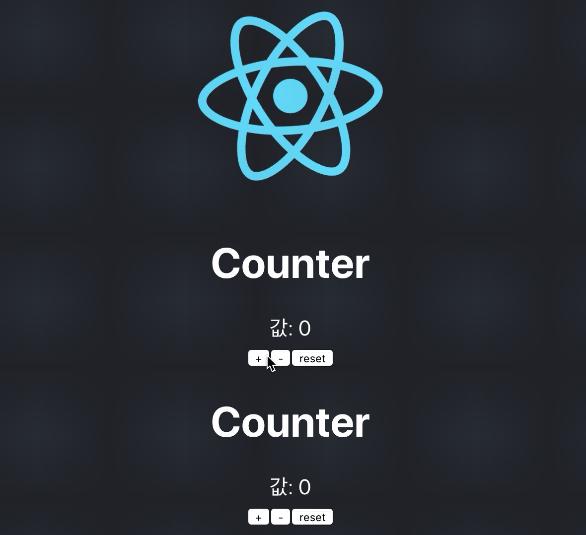

# 1주차 과제

## 1. 2씩 증가하는 카운터 만들기
- Counter 컴포넌트를 재사용해서 추가적인 state와 함수를 만들어서 2씩 증가하는 카운터 만들기

## 2. 1씩 증가하는 카운터와 2씩 증가하는 카운터의 리셋 버튼 만들기
- 각각의 카운터의 숫자를 함수를 추가해서 0으로 초기화

### 프로젝트 생성부터 하시면 더더욱 좋을것 같습니다!
### 과제는 github에 올리셔야 하며, 과제용 repository를 생성해서 슬랙에 공유 부탁 드리겠습니다.
### 과제를 제출 할때마다 과제용 repository에 그 주차의 폴더(ex. 1-week ->폴더 이름은 영어로 하는걸 추천드립니다)를 생성하셔서 프로젝트를 올려 주시면 됩니다. 

### 질문은 언제나 환영합니다!! 슬랙에 언제든지 질문을 올려주세요!

결과물
